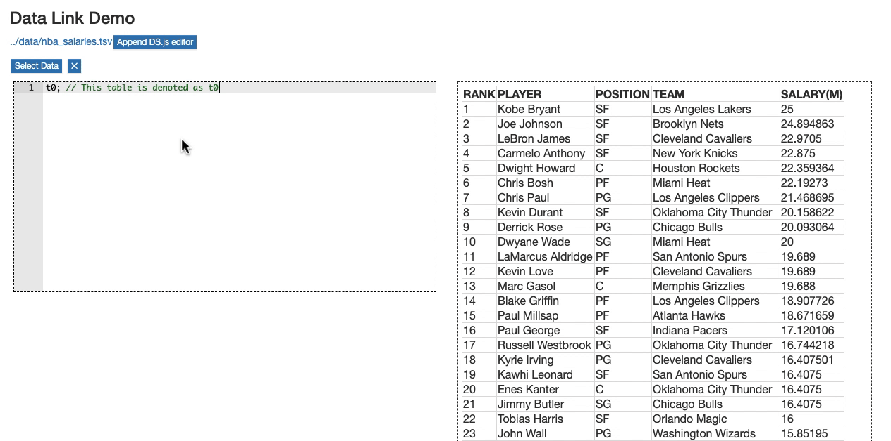

<!-- **Note: DS.js source code is still on its research prototype status (spaghetti-like code). Cleaning and documentation is on the way. Please contact the authors if you feel confused about any part of it.**

# DS.js Release TODOs
- [ ] Core code cleaning
- [ ] Loader code cleaning
- [ ] Example testing
- [ ] Compiled ds.js bookmarklet hosting
- [ ] Improved readme with API document
- [ ] Paper link -->

DS.js is a bookmarklet that converts any webpage with tabular datasets into an environment to learn basic Data Science programming. More details can be found in our UIST2017 research paper [DS.js: Turn Any Webpage into an Example-Centric Live
Programming Environment for Learning Data Science](http://www.pgbovine.net/publications/DSjs-turn-any-webpage-into-data-science-IDE_UIST-2017.pdf).

# Installation
Simply drag <a href="javascript: (    function() {        function js_load(url, cb) {            console.log(`loading ${url}`);            var js = document.createElement('script');            js.src = url;            if (cb) {                js.onload = cb;            }            document.body.appendChild(js);        }        function css_load(url, cb) {            var css = document.createElement('link');            css.setAttribute('href', url);            css.setAttribute('rel', 'stylesheet');            css.onload = cb;            document.head.appendChild(css);        }        sg_js_load = () => js_load('https://www.bearzx.com/ds.js/out/selectorgadget_combined.js');        sg_css_load = () => css_load('https://www.bearzx.com/ds.js/out/selectorgadget_combined.css', sg_js_load);        bundle_js_load = () => js_load('https://www.bearzx.com/ds.js/dist/bundle.js', sg_css_load);        bundle_css_load = () => css_load('https://www.bearzx.com/ds.js/out/ds.js.css', bundle_js_load);        vge_load = () => js_load('https://cdn.jsdelivr.net/npm/vega-embed@4', bundle_css_load);        vgl_load = () => js_load('https://cdn.jsdelivr.net/npm/vega-lite@3', vge_load);        vega_load = () => js_load('https://cdn.jsdelivr.net/npm/vega@5', vgl_load);        d3csv_load = () => js_load('https://d3js.org/d3-dsv.v1.min.js', vega_load);        d3_load = () => js_load('https://d3js.org/d3.v3.min.js', d3csv_load);        js_load('https://cdnjs.cloudflare.com/ajax/libs/ace/1.2.6/ace.js', d3_load);    }());">this link</a> to your bookmark bar and you are all set.

# DS.js Workflow

Here we show a typical workflow of using DS.js to put lightweight environments under tabular datasets and program inside it.

## Detect Tabular Datasets
Simply click on the DS.js bookmarklet to put DS.js environments under csv/tsv links or HTML tables.
> GIF Demo

## Program with table.js API
Manipulate the parsed datasets with dataframe style programming APIs.
> GIF Demo

## Visualize Data
Create visualizations with table.js, which wraps vega APIs.
> GIF Demo

## Preview from Code to Data or vice versa
Get hints about the usage of table.js APIs with previews.

### Code to Data Preivew
Move the editor cursor to a table.js manipulation function and press &#8984; + B to preview its effect.
> GIF Demo

### Data to Code Preview
When the output pane is showing a table, click on any cell to get in-context suggestions on available table.js APIs.
> GIF Demo

## Share your code via URLs
Copy the URL of the webpage with capsulated DS.js code and send it to others to share your work.
> GIF Demo

# table.js APIs
<!-- specify argument type indicators? -->
table.js is compiled from `src/table.ts` TypeScript source file. Here we show some short descriptions on its public APIs.

<!-- [TODO] better doc for pivot -->
<!-- [TODO] better doc for boxplot -->

| Function | is for ... |
| :------------- | :------------- |
| `convert(cast: Function)` | convert all the elements with a cast function (e.g. parseInt) |
| `converted(cast: Function)` | functional version of `convert` |
| `auto_convert()` | heuristically convert table cell content into numbers (using numeral.js) |
| `read_table_csv_sync(url: string)` | load .csv file from a remote url in a synchronous manner |
| `read_table_tsv_sync(url: string)` | load .tsv file from a remote url in a synchronous manner |
| `set(column_or_label, f)` | mutate the content of a column with a mapping function `f` |
| `get_element(row, col)` | get the content of a cell |
| `num_rows()` | get the number of rows |
| `get_column_names()` | get all the column labels in an array |
| `num_columns()` | get the number of columns |
| `get_column(index_or_label)` | get the content of a column given its index or label |
| `get_columns()` | get the content of all the columns in an array (of arrays) |
| `get_row(index)` | get the content of a row in an object given its index |
| `get_rows()` | get the content all the rows in an array (of objects) |
| `add_rows(rows)` | add one or more rows to the end of the table |
| `add_column(label, values)` | add a new column |
| `add_columns(...label_and_vales)` | add one or more columns |
| `rename_column(label, new_label)` | change the name of a column |
| `copy_table()` | get a copy of the current table |
| `select_columns(...column_label_or_labels)` | get a sub-table of selected columns |
| `drop_columns(...column_label_or_labels)` | drop one or more columns |
| `where(column_or_label, value_or_predicate)` | filter rows based on the values of a given column by exactly matching a value or applying a predicate |
| `sort(column_or_label, descending = false)` | sort all the rows based on the values of a given column |
| `sorted(column_or_label, descending = false)` | functional version `sort` |
| `groupby(column_or_label, collect?)` | aggregate all the rows based on a column, count the occurrence by default |
| `groupsby(columns_or_labels, collect?)` | aggregate all the rows based on more than one columns, count the occurrence by default |
| `pivot(columns, rows, values, collect?)` | generate a pivot table |
| `join(column_label, other: Table, other_label?)` | join with another table based on two columns |
| `summary_statistics()` | generate a summary table (including min, max, median, sum) of all the columns |
| `percentile(p)` | get the first p% sorted rows |
| `sample_n_random_rows(k)` | randomly sample k rows |
| `split(k)` | split the current table into two: first k rows and the last n - k rows |
| `lineplot(xlabel, ylabel, xtype = 'quantitative')` | generate a line plot of two columns |
| `barplot(xlabel, ylabel, xtype = 'nominal', ytype = 'quantitative' )` | generate a bar plot of two columns |
| `scatterplot(xlabel, ylabel, xtype = 'quantitative')` | generate a scatter plot of two columns |
| `histogram(column, nbins = 10)` | generate a histogram of a column |
| `boxplot(xlabel, ylabel)` | generate a boxplot of two columns |

# Demo Vlogs
> TODO

# Example Pages
A made-up webpage with example code to show the table.js APIs can be found [here](https://www.bearzx.com/ds.js/samples/demo.html?dsjs%5B0-0%5D%5Bcode%5D=t0%3B%20%2F%2F%20This%20table%20is%20denoted%20as%20t0%0At0.num_rows()%3B%0At0.num_columns()%3B%0At0.get_row(50)%3B%0At0.get_column(%27PLAYER%27)%3B%0At0.get_element(10%2C%20%27POSITION%27)%3B%0At0.get_column_names()%3B%0At0.sample_n_random_rows(10)%3B%0A%0At0.add_row(%7B%22RANK%22%3A101%2C%22PLAYER%22%3A%22Jason%20Thompson%22%2C%22POSITION%22%3A%22PF%22%2C%22TEAM%22%3A%22Golden%20State%20Warriors%22%2C%22SALARY(M)%22%3A7.008475%7D)%3B%0At0.add_column(%27Blah%27%2C%20%5B1234%5D)%3B%0At0.rename_column(%27POSITION%27%2C%20%27PLAYER%20POSITION%27)%3B%0At0.select_columns(%27RANK%27%2C%20%27PLAYER%27)%3B%0At0.drop_columns(%27SALARY(M)%27)%3B%0At0.sorted(%27SALARY(M)%27)%3B%0At0.where(%27POSITION%27%2C%20x%20%3D%3E%20x%20%3D%3D%20%27SF%27)%3B%0At0.groupby(%27POSITION%27)%3B%0At0_1%20%3D%20t0.select_columns(%27RANK%27%2C%20%27PLAYER%27%2C%20%27POSITION%27)%3B%0At0_2%20%3D%20t0.drop_columns(%27RANK%27%2C%20%27POSITION%27)%3B%0At0_1.join(%27PLAYER%27%2C%20t0_2%2C%20%27PLAYER%27)%3B%0At0.pivot(%27POSITION%27%2C%20%27TEAM%27%2C%20%27SALARY(M)%27%2C%20d3.mean)%3B%0A%0At0.lineplot(%27RANK%27%2C%20%27SALARY(M)%27)%3B%0At0.scatterplot(%27RANK%27%2C%20%27SALARY(M)%27)%3B%0At0.groupby(%27TEAM%27).barplot(%27TEAM%27%2C%20%27count%27%2C%20%27nominal%27)%3B%0At0.histogram(%27SALARY(M)%27%2C%2030)%3B%0At0.boxplot(%27SALARY(M)%27%2C%20%27POSITION%27)%3B%0A&dsjs%5B0-0%5D%5Bcrow%5D=26&dsjs%5B0-0%5D%5Bccol%5D=0).

# Build Instructions
We are able to build the system with the following environment: macOS 10.14.5, node 10, webpack 4.

To build the system, in the project root, simply type `webpack` (after `npm install`). If everything goes correctly you should be able to find the compiled and bundled js code in the `dist/` directory.

# License
MIT
